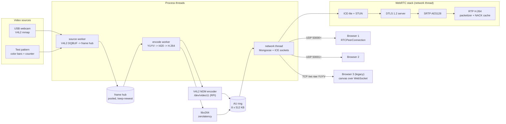
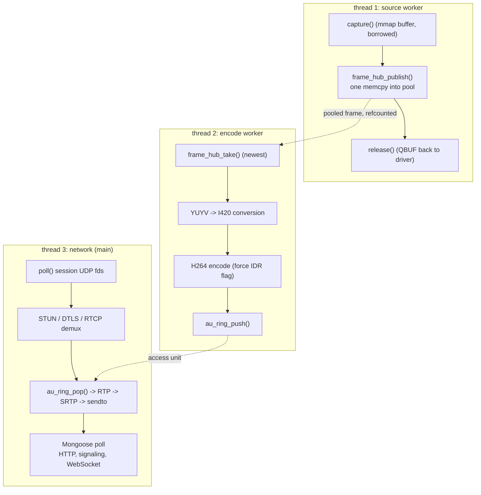
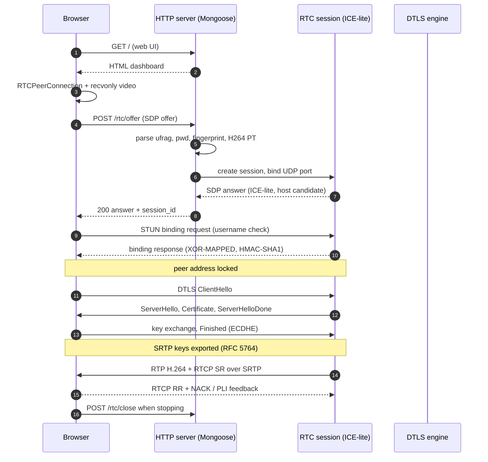
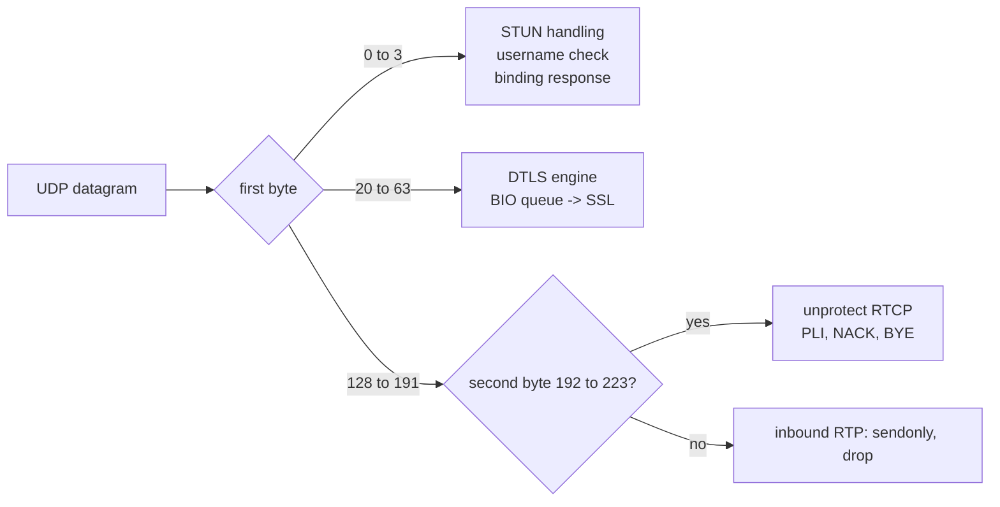
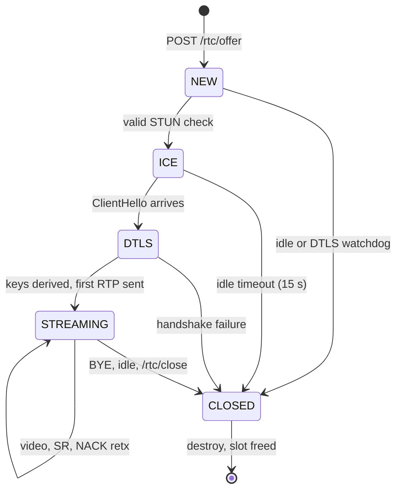
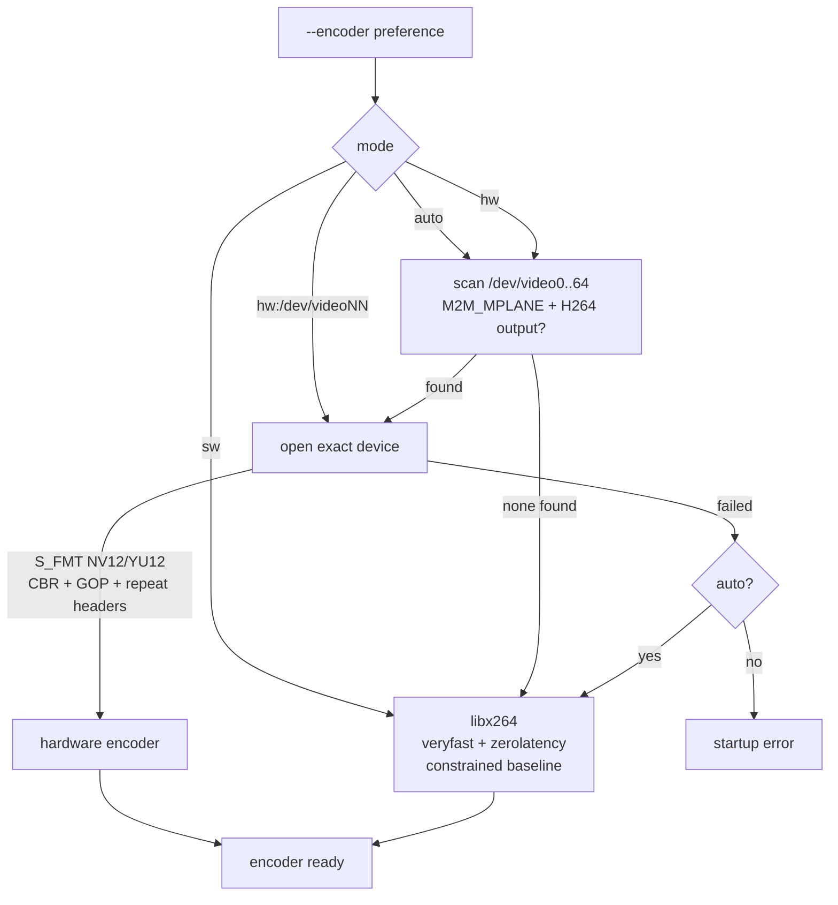

# camstream

Low latency camera to browser streaming server in C11 with a **real WebRTC media path**: ICE-lite, DTLS 1.2, SRTP and RTP H.264, all implemented natively. Runs on generic Linux laptops and Raspberry Pi OS.

```
camera (V4L2 or test pattern)
        |
        v
   H.264 encode        hardware V4L2 M2M encoder first (Raspberry Pi GPU),
        |              libx264 software fallback
        v
   RTP packetize  ->  SRTP encrypt  ->  UDP to every viewer
                                                        ^
   HTTP + SDP signaling (Mongoose)  <---- browser: RTCPeerConnection
```

## What this is

One binary, `build/camstream`, serves:

| Layer | Before (stage 4) | Now (2.0) |
|---|---|---|
| Transport | WebSocket, raw YUYV frames | **WebRTC**: ICE-lite + DTLS 1.2 + SRTP + RTP |
| Video codec | none, uncompressed | H.264 (hardware probe, then libx264) |
| Bandwidth at 640x480@30 | ~139 Mbps per viewer | ~2 to 4 Mbps per viewer |
| Encryption | none | DTLS 1.2 handshake, SRTP AES128 with per session keys |
| Loss recovery | none | NACK retransmission cache, PLI keyframe requests |
| Viewers | 1 WebSocket client | up to 8 simultaneous WebRTC sessions + 1 legacy |
| UI | basic canvas page | dashboard: stats, timeline, logs, sparklines, fallback |
| Build | http_server only | `make` (WebRTC) + `make legacy` (stage 4 preserved) |

The legacy WebSocket transport is still available from the web UI as a diagnostics fallback.

## Quick start

```bash
# Debian, Ubuntu, Raspberry Pi OS
sudo apt install build-essential libssl-dev libsrtp2-dev libx264-dev

make
sudo usermod -aG video $USER    # then log out and back in

# with a USB webcam
./build/camstream --device /dev/video0

# without any camera: synthetic test pattern
./build/camstream --test
```

The server prints every usable URL on startup:

```
camstream 2.0.0 ready
open http://192.168.1.10:8080/   (eth0)
```

Open that URL from any browser on the same network and press **Start WebRTC**.

Fedora: `sudo dnf install gcc make openssl-devel libsrtp-devel x264-devel`

## Documentation index

| Document | Contents |
|---|---|
| [docs/10_architecture.md](docs/10_architecture.md) | Module reference, threading model, memory pools |
| [docs/11_webrtc_internals.md](docs/11_webrtc_internals.md) | ICE-lite, DTLS, SRTP, RTP, RTCP, SDP internals |
| [docs/12_build_reference.md](docs/12_build_reference.md) | Dependencies, Make variables, per distro install |
| [docs/13_lan_two_laptops.md](docs/13_lan_two_laptops.md) | Connect two laptops with a LAN cable, step by step |
| [docs/14_raspberry_pi.md](docs/14_raspberry_pi.md) | Raspberry Pi OS: hardware encoder, service, tuning |
| [docs/15_optimization_notes.md](docs/15_optimization_notes.md) | Every optimization, before and after |
| [docs/16_protocol_reference.md](docs/16_protocol_reference.md) | Packet formats, ports, JSON API |
| [docs/17_troubleshooting.md](docs/17_troubleshooting.md) | Decision tree and fault tables |
| [docs/04_http_websocket_test.md](docs/04_http_websocket_test.md) | Stage 4 legacy test notes (kept for history) |

## System architecture



### Thread model



Locking is minimal on purpose: the hub takes a per consumer mutex only during slot swap, the AU ring takes one mutex per push or pop, and every WebRTC session is touched exclusively by the network thread.

## WebRTC connection flow



### Datagram demultiplexing (RFC 7983)

Every UDP datagram is classified by its first byte:



### Session life cycle



## Encoder selection



At runtime the hardware path tolerates transient stalls (returns 0 output while the pipeline drains); repeated hard failures disable it with a clear log line.

## Command line

| Option | Default | Meaning |
|---|---|---|
| `-d, --device PATH` | `/dev/video0` | V4L2 capture device |
| `-t, --test` | off | synthetic test pattern, no camera needed |
| `-W, --width N` | 640 | capture width |
| `-H, --height N` | 480 | capture height |
| `-F, --fps N` | 30 | frames per second |
| `-l, --listen ADDR` | `0.0.0.0` | HTTP listen address |
| `-p, --http-port N` | 8080 | HTTP and WebSocket port |
| `-u, --udp-port N` | 50000 | base UDP port for media, one per viewer |
| `-e, --encoder MODE` | `auto` | `auto`, `hw`, `hw:/dev/videoNN`, `sw` |
| `-b, --bitrate KBPS` | 2500 | target bitrate |
| `-K, --keyframe SEC` | 2 | keyframe interval |
| `-v, --verbose` | off | verbose logging |

## HTTP API

| Method and path | Purpose |
|---|---|
| `GET /` | web dashboard |
| `GET /status` | JSON: source, encoder, sessions, interfaces, counters |
| `POST /rtc/offer` | signaling: SDP offer in, SDP answer out |
| `POST /rtc/close` | close one session by `session_id` |
| `GET /ws` | legacy WebSocket upgrade (raw YUYV binary frames) |

`GET /status` example (trimmed):

```json
{
  "version": "2.0.0",
  "source": { "name": "v4l2 /dev/video0", "width": 640, "height": 480, "fps": 30 },
  "encoder": { "name": "v4l2 m2m /dev/video11", "bitrate_kbps": 2500 },
  "sessions": [ { "id": 174825277, "state": "streaming", "udp_port": 50000 } ],
  "interfaces": [ { "name": "eth0", "ip": "192.168.1.10" } ]
}
```

## Two laptops over a LAN cable (short version)

1. Connect both laptops with any Ethernet cable (modern NICs auto crossover).
2. Set static IPs: laptop A `192.168.50.1/24`, laptop B `192.168.50.2/24`.
3. `ping` both ways.
4. Open the firewall: TCP 8080 and the UDP port range 50000 to 50008.
5. Run `./build/camstream` on the laptop with the camera.
6. On the other laptop open `http://192.168.50.1:8080/` and press **Start WebRTC**.

Full walkthrough with GUI and CLI instructions for Linux, Windows and macOS: [docs/13_lan_two_laptops.md](docs/13_lan_two_laptops.md)

## Raspberry Pi (short version)

```bash
sudo apt install build-essential libssl-dev libsrtp2-dev libx264-dev
make                                   # picks /dev/video11 automatically
./build/camstream -d /dev/video0 -W 1280 -H 720 -b 4000
```

USB webcams work directly. The bcm2835 hardware encoder keeps CPU load low on Pi 3, 4 and 5. Full guide including CSI camera options, permissions and a systemd unit: [docs/14_raspberry_pi.md](docs/14_raspberry_pi.md)

## Repository layout

```
include/
  app/          app_config.h, app_server.h
  media/        frame_pool.h, frame_hub.h, video_source.h, yuv_convert.h,
                h264_encoder.h, encoder_worker.h, au_ring.h, source_worker.h
  webrtc/       ice_lite.h, dtls_srtp.h, rtp_h264.h, rtcp.h, sdp.h,
                webrtc_session.h
  legacy/       stage 4 headers (untouched)
src/
  camstream_main.c
  app/          app_server.c, app_config.c, web_ui.c
  media/        frame_pool.c, frame_hub.c, au_ring.c, source_worker.c,
                v4l2_source.c, test_source.c, yuv_convert.c,
                h264_encoder.c, encoder_x264.c, encoder_v4l2m2m.c,
                encoder_worker.c
  webrtc/       ice_lite.c, dtls_srtp.c, rtp_h264.c, rtcp.c, sdp.c,
                webrtc_session.c
  legacy/       stage 4 sources (untouched, build with make legacy)
third_party/
  mongoose/     Mongoose 7.23 networking library
docs/           architecture, internals, build, LAN, Pi, optimization,
                protocol reference, troubleshooting
```

## Verification status

Verified on every commit in CI-less fashion by scripted checks:

| Check | Result |
|---|---|
| `make` and `make legacy` compile warning free (gcc 12, C11) | pass |
| SDP offer parsing and answer generation | pass |
| STUN binding request validation, XOR-MAPPED + MI + fingerprint response | pass |
| Session create, idle timeout, `/rtc/close` lifecycle | pass |
| Encoder gating: 440 frames encoded while a session was live | pass |
| DTLS flight handling: ClientHello reaches the handshake engine, state reaches `dtls` | pass |
| Full DTLS-SRTP handshake and browser media path | validated on target hardware (see docs/17) |

## Browser support

Chrome and Chromium, Edge, Firefox and Safari all speak the negotiated baseline: ICE, DTLS 1.2 with SRTP_AES128_CM_SHA1_80, H.264 constrained baseline, NACK and PLI feedback. The dashboard requires a modern browser (ES2017 level JavaScript).

## License

Third party Mongoose is GPLv2/commercial dual licensed, see `third_party/mongoose/LICENSE`. Project code follows the repository license header conventions of the existing tree.
