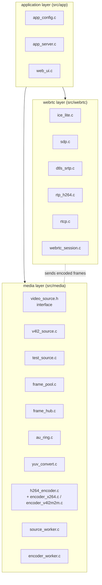
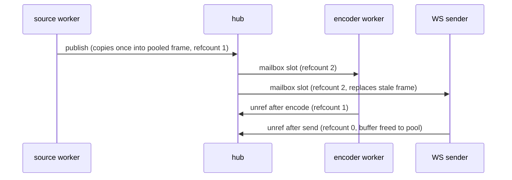

# Architecture

camstream 2.0 is a single process with three long lived threads and a strictly layered data path:

Dependency rule: media never calls webrtc, webrtc never calls mongoose, only app_server composes everything.

## Threading model

| Thread | Owns | Blocking behavior |
|---|---|---|
| main (network) | Mongoose loop, all RTC sessions, WS sender | poll() with 10 ms ceiling, plus DTLS timer deadlines |
| source worker | VideoSource, hub publish | blocks in poll(DQBUF) up to 200 ms |
| encode worker | hub consumer, converter, encoder, AU ring | sleeps 2 ms when no new frame |

Shutdown: SIGINT/SIGTERM set a flag, the network loop exits, threads observe the flag within one poll period, then join and destroy in reverse creation order.

## Memory pools

Two pooled structures remove the allocator from the hot path entirely:

**frame_pool**: fixed count of pre-allocated buffers, refcounted. The hub delivers the same buffer to N consumers by reference; a buffer returns to the pool when the last consumer releases it.

**au_ring**: 8 slots x 512 KB for encoded access units. Producer overwrites the oldest slot under pressure: for live video, freshness beats completeness.

Keep-newest semantics apply end to end. A slow consumer sees the newest frame and never accumulates a backlog; the previous frame is dropped and counted (`au_dropped`, `frames_dropped` in `/status`).

## Video source abstraction

`VideoSource` (include/media/video_source.h) is a small vtable: start, capture, release, close. Two implementations:

- **v4l2_source**: mmap streaming, YUYV preferred, YU12 accepted, poll() driven with 200 ms timeout for responsive shutdown. Frames are borrowed pointers into mmap buffers; the caller copies into the hub and immediately QBUFs the buffer back.
- **test_source**: clock_nanosleep paced color bars with a moving marker and frame counter. Identical YUYV contract, so the whole downstream pipeline is exercised without hardware.

## Encoder abstraction

`h264_encoder_open()` resolves the preference string (auto, hw, hw:path, sw) to a backend and returns a dispatch struct. Backends:

- **encoder_v4l2m2m**: stateful V4L2 encoder per the kernel spec. OUTPUT queue gets NV12 or YU12 frames (converted from I420 by the backend), CAPTURE queue yields Annex-B H.264. Optional controls (CBR bitrate, GOP size, repeat SPS/PPS) are applied when the driver supports them and ignored otherwise.
- **encoder_x264**: veryfast + zerolatency, constrained baseline, repeated headers, ABR with VBV, single thread for deterministic latency.

Both emit Annex-B access units with SPS/PPS in front of every IDR, which lets a viewer join mid stream (the session forces an IDR on join).

## WebRTC session object

One viewer maps to one `RtcSession`:

- its own UDP socket (port = configured base + slot)
- generated local ICE credentials, validated on every STUN check
- a `DtlsSrtp` engine (SSL object plus custom BIOs over that socket)
- an `RtpH264` packetizer with a 512 entry retransmission cache
- stats exposed through `/status`

The network thread owns sessions exclusively: no locks needed anywhere in src/webrtc.

## Web UI

`src/app/web_ui.c` embeds the complete dashboard as one C string: no external asset loading, no CDN, works on an isolated LAN. It contains the WebRTC player with `getStats()` polling, sparkline charts, the six step connection timeline, the viewer table, the server card and the legacy WebSocket fallback with canvas YUYV rendering.

## Legacy stage 4

The previous generation sources live untouched under `src/legacy/` and `include/legacy/`, buildable with `make legacy` for comparison and regression testing.
