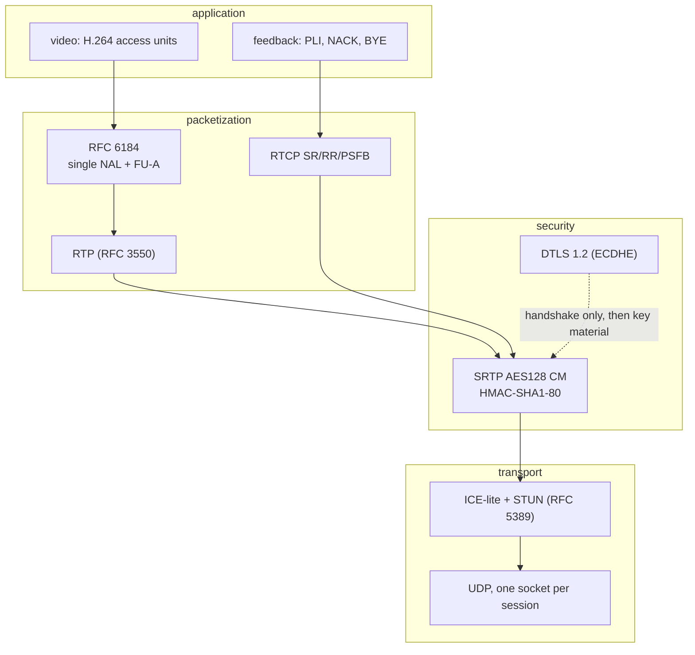
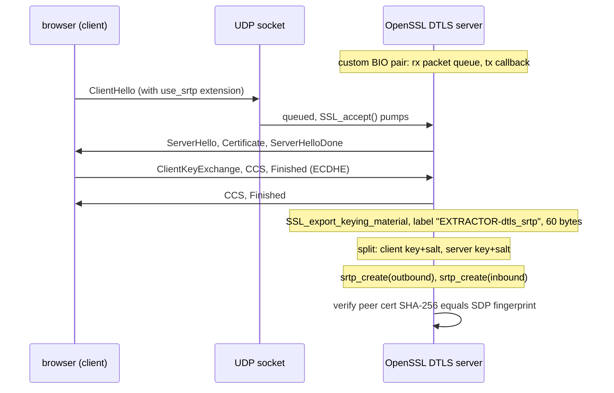

# WebRTC internals

This document explains every protocol step the C server implements, and where each piece lives in the code.

## Protocol stack

## Signaling (HTTP POST)

`POST /rtc/offer` with `{"type":"offer","sdp":"..."}`. The server (src/webrtc/sdp.c):

1. extracts `a=ice-ufrag`, `a=ice-pwd`, `a=fingerprint`
2. finds the first `a=rtpmap:N H264/90000` payload type in the video section
3. records `a=mid` values and whether audio exists
4. builds the answer: audio rejected (port 9, inactive), video sendonly with
   - `a=ice-lite`, fresh local ufrag/pwd
   - the DTLS SHA-256 fingerprint of a certificate generated at startup
   - `a=setup:passive` (the browser is the DTLS client)
   - `a=candidate:... typ host` pointing at the address the browser used to reach the page
   - `a=rtcp-fb` for `nack`, `nack pli`, `ccm fir`

The address advertised is derived from the HTTP `Host` header when it matches a local interface, otherwise from the first private IPv4 address. This makes multi-homed machines (Ethernet plus Wi-Fi plus VPN) advertise a reachable candidate.

## ICE-lite

Implemented in src/webrtc/ice_lite.c and the session:

- The server never gathers candidates or sends checks. It answers whatever arrives.
- A binding request is accepted when: type 0x0001, magic cookie present, and USERNAME starts with `<local-ufrag>:`.
- The response carries XOR-MAPPED-ADDRESS, MESSAGE-INTEGRITY (HMAC-SHA1 over the message with the length including the MI attribute, keyed with the local pwd) and FINGERPRINT (CRC32 XOR 0x5354554e).
- The source address of the first valid check becomes the peer address for every later send (STUN responses, DTLS records, SRTP).

## DTLS 1.2 with SRTP key export

src/webrtc/dtls_srtp.c:

Engineering details that matter:

- **Custom BIOs**: OpenSSL never touches a socket. Inbound datagrams are queued; outbound records go through a callback to `sendto`. This keeps the poll loop in full control.
- **Fixed MTU**: `SSL_OP_NO_QUERY_MTU` plus `SSL_set_mtu(1200)` keeps every DTLS flight and SRTP packet under the safe path MTU.
- **Timers**: `DTLSv1_get_timeout` feeds the main poll timeout; expiry triggers `DTLSv1_handle_timeout` for flight retransmission.
- **Certificate**: an ECDSA P-256 certificate is generated at startup (one per process, no files), and its SHA-256 fingerprint goes into every SDP answer.
- **Profile pinning**: only `SRTP_AES128_CM_SHA1_80` is offered, which fixes the exported key layout at exactly 60 bytes and matches every browser stack.

## RTP H.264 packetization

src/webrtc/rtp_h264.c, per RFC 6184:

- Annex-B start codes are scanned, each NAL becomes either a single NAL packet (fits in 1188 payload bytes) or FU-A fragments of 1186 bytes.
- 90 kHz timestamps derive from the capture timestamps; the marker bit marks the last packet of an access unit.
- Sequence numbers increment per RTP packet; the SSRC is random per session.

### Retransmission cache

After `srtp_protect`, the protected bytes are stored in a 512 slot ring indexed by sequence number. A NACK lists lost sequence numbers; the cached packets are resent verbatim (identical SRTP bytes, which receivers accept for retransmission).

### Keyframes

Three triggers request an IDR, all funneling into one atomic flag read by the encode thread:

1. session enters STREAMING (fresh viewer needs a decodable start)
2. PLI or FIR feedback arrives (decoder lost sync), rate limited to one per 400 ms
3. server startup warmup

x264 honors the flag with `X264_TYPE_IDR`; the hardware path uses `V4L2_BUF_FLAG_KEYFRAME` plus `V4L2_CID_MPEG_VIDEO_REPEAT_SEQ_HEADER` so SPS/PPS ride along with every IDR.

## RTCP

- Sender Reports every second carry NTP/RTP timestamp pairs, packet and octet counters for receiver bitrate estimation.
- Inbound compound packets are parsed for PSFB PLI (FMT 1), Generic NACK (FMT 2, PID plus 16 bit loss bitmaps expanded per entry), FIR (FMT 4) and BYE.
- BYE closes the session cleanly.

## Wire format summary

| Direction | Packet | Notes |
|---|---|---|
| in | STUN binding request | 20 byte header + attributes, answered inline |
| in | DTLS records | handshake and close_notify only |
| in | RTCP (SRTP protected) | RR, NACK, PLI, FIR, BYE |
| out | STUN binding response | XOR-MAPPED + MI + FINGERPRINT |
| out | DTLS records | handshake flights, close_notify |
| out | RTCP SR | once per second |
| out | RTP H.264 (SRTP protected) | 1200 byte ceiling, FU-A for large NALs |

Full byte layouts: see [16_protocol_reference.md](16_protocol_reference.md).
