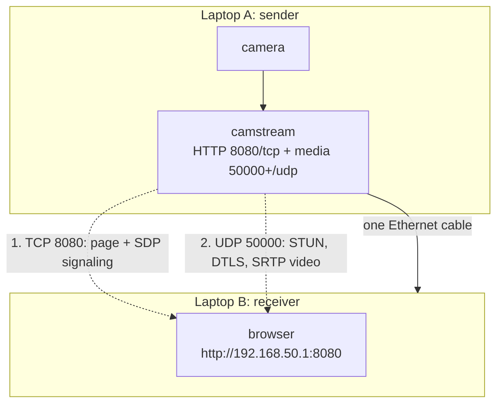

# Connect two laptops with a LAN cable

Goal: laptop A runs camstream with a camera, laptop B watches the live WebRTC stream, using nothing but one Ethernet cable between them. No router, no switch, no internet.

Works with: any two computers with Ethernet ports, any regular patch cable (Cat5e or better). Modern network cards do auto crossover, so a special crossover cable is not needed.

## Overview



Two flows travel over the cable:

1. **TCP 8080**: the web page and the SDP offer/answer exchange.
2. **UDP 50000+**: STUN connectivity checks, the DTLS handshake and the actual encrypted video.

Both must be reachable, so both protocols need to pass the firewall.

## Step by step


### Step 1: connect the cable

Plug the cable between the two laptops. After a few seconds the link LED on the port (if present) turns on.

### Step 2: assign static IP addresses

Pick one laptop as the sender. Use any private range, for example `192.168.50.0/24`:

| Laptop | Role | IP | Netmask | Gateway |
|---|---|---|---|---|
| A (with camera) | server | `192.168.50.1` | `255.255.255.0` | none |
| B (viewer) | client | `192.168.50.2` | `255.255.255.0` | none |

No gateway and no DNS are needed: the link is direct.

**Linux (NetworkManager GUI):** Settings, Network, wired connection, IPv4 tab, Manual, fill the address for each laptop, apply.

**Linux (CLI, temporary until reboot):**

```bash
# laptop A
sudo ip addr add 192.168.50.1/24 dev eth0
sudo ip link set eth0 up

# laptop B
sudo ip addr add 192.168.50.2/24 dev eth0
sudo ip link set eth0 up
```

Replace `eth0` with your interface name from `ip addr` (could be `enp3s0` or similar).

**Windows 10/11:** Settings, Network and Internet, Ethernet, Edit IP assignment, Manual, IPv4 on. Fill IP, mask `255.255.255.0`, leave gateway and DNS empty.

**macOS:** System Settings, Network, Ethernet, Details, TCP/IP, Configure IPv4: Manually.

### Step 3: verify with ping

```bash
# from laptop B
ping 192.168.50.1
```

You should see replies within a millisecond. If not, recheck addresses and mask on both sides, and make sure both interfaces show UP in `ip addr` (or `ipconfig` / `ifconfig`).

### Step 4: open the firewall ports

camstream needs, with defaults:

| Port | Protocol | Purpose |
|---|---|---|
| 8080 | TCP | web page + WebRTC signaling (HTTP) |
| 50000 to 50007 | UDP | one media port per simultaneous viewer (WebRTC) |

**ufw (Ubuntu and most desktop distros), run on laptop A:**

```bash
sudo ufw allow 8080/tcp
sudo ufw allow 50000:50008/udp
```

**firewalld (Fedora), run on laptop A:**

```bash
sudo firewall-cmd --add-port=8080/tcp --add-port=50000-50008/udp --permanent
sudo firewall-cmd --reload
```

**Windows (laptop B usually allows outbound by default):** no inbound rule needed on the viewer. If you run the server on Windows under WSL2, see the troubleshooting doc instead.

Quick test of a closed port: `curl -m 3 http://192.168.50.1:8080/status`. If this hangs but ping works, the firewall on A blocks TCP 8080.

### Step 5: start the server on laptop A

```bash
cd ideal-broccoli
./build/camstream --device /dev/video0

# no camera attached? demonstrate with the test pattern:
./build/camstream --test
```

The startup banner lists every address the page can be opened on. Look for the one matching your cable subnet:

```
camstream 2.0.0 ready
open http://192.168.50.1:8080/   (eth0)
```

### Step 6: open the dashboard on laptop B

In any modern browser: `http://192.168.50.1:8080/`

The server card in the dashboard shows the encoder in use, captured and encoded frame counters, and all server addresses.

### Step 7: press Start WebRTC

Watch the connection timeline light up in order:


Each step turns green when it completes. If a step turns red or stalls, jump to the table below.

### Step 8: verify quality

The receiver statistics panel shows live values straight from the browser's `getStats()`:

| Metric | Healthy value on a direct cable |
|---|---|
| FPS | equal to the configured capture rate (for example 30) |
| Mbps | close to `--bitrate` (2.5 default), never above it for long |
| RTT | typically under 5 ms on a direct link |
| jitter | below 2 ms |
| packets lost | stays 0 or near 0 |

The end to end glass to glass latency on this path is typically 150 to 300 ms at 640x480@30, dominated by capture buffering and the decoder jitter buffer.

## Fault finder

| Symptom | Cause | Fix |
|---|---|---|
| ping fails | wrong IP, mask, or interface down | recheck step 2, `ip addr` |
| page does not open, ping works | firewall blocks TCP 8080 | step 4 commands |
| page opens, timeline stuck at SDP | browser extensions stripping POST bodies | disable extension or try another browser |
| SDP ok, ICE fails | firewall blocks UDP range, or browser is behind a restrictive proxy | open UDP ports, avoid proxies for this page |
| ICE ok, DTLS stalls | MTU issues or very old browser | update browser, check cable quality |
| Video stalls then resumes | packet loss bursts | lower bitrate with `-b 1500`, shorter keyframe `-K 1` |
| Page loads but ICE never succeeds | TCP 8080 passes, UDP blocked | firewall UDP range, see step 4 |

More depth in [17_troubleshooting.md](17_troubleshooting.md).

## Alternative: zero configuration link local addresses

If you cannot set static IPs, let both laptops self assign link local addresses (`169.254.x.x`). Both operating systems do this automatically after one to two minutes on an unconfigured link, then:

```bash
# laptop A: discover its link local address
ip addr show eth0        # look for 169.254.x.x
```

Open `http://169.254.x.x:8080/` from laptop B. Static IPs are still recommended: deterministic, and documented startup URLs stay stable.
